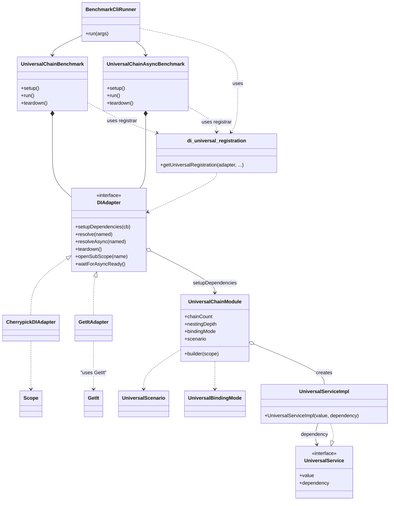

# benchmark_di

_Benchmark suite for cherrypick DI container, get_it, and other DI solutions._

## Overview

benchmark_di is a flexible benchmarking suite to compare DI containers (like cherrypick and get_it) on synthetic, deep, and real-world dependency scenarios – chains, factories, async, named, override, etc.

**Features:**
- Universal registration layer and modular scenario setup (works with any DI)
- Built-in support for [cherrypick](https://github.com/) and [get_it](https://pub.dev/packages/get_it)
- Clean CLI for matrix runs and output formats (Markdown, CSV, JSON, pretty)
- Reports metrics: timings, memory (RSS, peak), statistical spreads, and more
- Extendable via your own DIAdapter or benchmark scenarios

---

## Benchmark Scenarios

- **registerSingleton**: Simple singleton registration/resolution
- **chainSingleton**: Resolution of long singleton chains (A→B→C...)
- **chainFactory**: Chain resolution via factories (new instances each time)
- **asyncChain**: Async chain (with async providers)
- **named**: Named/qualified resolution (e.g. from multiple implementations)
- **override**: Resolution and override in subScopes/child adapters

---

## Supported DI

- **cherrypick** (default)
- **get_it**
- Easy to add your own DI by creating a DIAdapter

Switch DI with the CLI option: `--di`

---

## How to Run

1. **Install dependencies:**
   ```shell
   dart pub get
   ```

2. **Run all benchmarks (default: all scenarios, 2 warmup, 2 repeats):**
   ```shell
   dart run bin/main.dart --benchmark=all --format=markdown
   ```

3. **For get_it:**
   ```shell
   dart run bin/main.dart --di=getit --benchmark=all --format=markdown
   ```

4. **Show all CLI options:**
   ```shell
   dart run bin/main.dart --help
   ```

### CLI Parameters

- `--di` — DI implementation: `cherrypick` (default) or `getit`
- `--benchmark, -b` — Scenario: `registerSingleton`, `chainSingleton`, `chainFactory`, `asyncChain`, `named`, `override`, `all`
- `--chainCount, -c` — Number of parallel chains (e.g. `10,100`)
- `--nestingDepth, -d` — Chain depth (e.g. `5,10`)
- `--repeat, -r` — Measurement repeats (default: 2)
- `--warmup, -w` — Warmup runs (default: 1)
- `--format, -f` — Output: `pretty`, `csv`, `json`, `markdown`
- `--help, -h` — Usage

### Run Examples

- **All benchmarks for cherrypick:**
  ```shell
  dart run bin/main.dart --di=cherrypick --benchmark=all --format=markdown
  ```

- **For get_it (all scenarios):**
  ```shell
  dart run bin/main.dart --di=getit --benchmark=all --format=markdown
  ```

- **Specify chains/depth matrix:**
  ```shell
  dart run bin/main.dart --benchmark=chainSingleton --chainCount=10,100 --nestingDepth=5,10 --repeat=3 --format=csv
  ```

---

## How to Add Your Own DI

1. Implement a class extending `DIAdapter` (`lib/di_adapters/your_adapter.dart`)
2. Register it in CLI (see `cli/benchmark_cli.dart`)
3. Add registration logic to `di_universal_registration.dart` to build chains for your DI

---

## Architecture



---

## Metrics

Always collected:
- **Timings** (microseconds): mean, median, stddev, min, max
- **Memory**: RSS difference, peak RSS

## License

MIT
