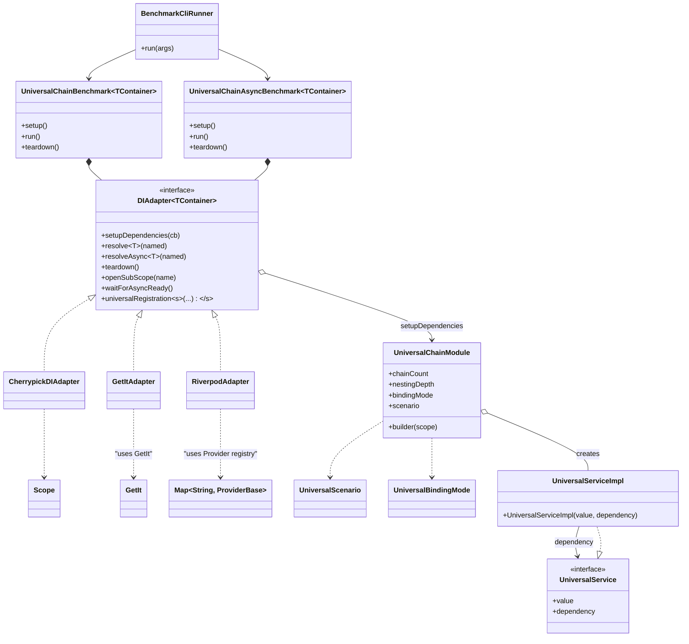

# benchmark_di

_Benchmark suite for cherrypick DI container, get_it, and other DI solutions._


> **Before changing the measurement apparatus** read [METHODOLOGY.md](METHODOLOGY.md).
> Every decision there is documented together with the measurement that caused
> it. Several of them look like unnecessary complexity — batching, one process
> per scenario, median instead of mean, containers refusing a scenario instead of
> silently substituting it — and would be reverted without that document.

> **Reproducing the numbers:** [REPRODUCE.md](REPRODUCE.md) — the exact commands
> behind every table in the reports, the expected run-to-run spread, and what to
> check when your numbers disagree.

## How to produce publishable numbers

```shell
./tool/run_matrix.sh
```

The script runs every (DI, scenario) pair in its own process, in both JIT and
AOT modes. Do not assemble tables by hand: numbers from `--benchmark=all` are
unusable for memory comparison, because process RSS is inherited between
scenarios.

Every result row carries `runtime_mode` and `cycle_detection`. A report without
those fields is considered invalid — JIT and AOT reorder the containers, and the
cherrypick fast path only applies with cycle detection off.

## Overview

benchmark_di is a flexible benchmarking suite to compare DI containers (like cherrypick and get_it) on synthetic, deep, and real-world dependency scenarios – chains, factories, async, named, override, etc.

**Features:**
- Universal registration layer and modular scenario setup (works with any DI)
- Built-in support for [cherrypick](https://github.com/) and [get_it](https://pub.dev/packages/get_it)
- Clean CLI for matrix runs and output formats (Markdown, CSV, JSON, pretty)
- Reports metrics: timings, memory (RSS, peak), statistical spreads, and more
- Extendable via your own DIAdapter or benchmark scenarios

---

## Benchmark Scenarios

- **registerSingleton**: Simple singleton registration/resolution
- **chainSingleton**: Resolution of long singleton chains (A→B→C...)
- **chainFactory**: Chain resolution via factories (new instances each time)
- **asyncChain**: Async chain (with async providers)
- **named**: Named/qualified resolution (e.g. from multiple implementations)
- **override**: Resolution and override in subScopes/child adapters

---

## Supported DI

- **cherrypick** (default)
- **get_it**
- Easy to add your own DI by creating a DIAdapter

Switch DI with the CLI option: `--di`

---

## How to Run

1. **Install dependencies:**
   ```shell
   dart pub get
   ```

2. **Run all benchmarks (default: all scenarios, 2 warmup, 2 repeats):**
   ```shell
   dart run bin/main.dart --benchmark=all --format=markdown
   ```

3. **For get_it:**
   ```shell
   dart run bin/main.dart --di=getit --benchmark=all --format=markdown
   ```

4. **Show all CLI options:**
   ```shell
   dart run bin/main.dart --help
   ```

### CLI Parameters

- `--di` — DI implementation: `cherrypick` (default) or `getit`
- `--benchmark, -b` — Scenario: `registerSingleton`, `chainSingleton`, `chainFactory`, `asyncChain`, `named`, `override`, `all`
- `--chainCount, -c` — Number of parallel chains (e.g. `10,100`)
- `--nestingDepth, -d` — Chain depth (e.g. `5,10`)
- `--repeat, -r` — Measurement repeats (default: 2)
- `--warmup, -w` — Warmup runs (default: 1)
- `--format, -f` — Output: `pretty`, `csv`, `json`, `markdown`
- `--help, -h` — Usage

> Short flags take a space (`-c 100`), not an equals sign (`-c=100`). With `-c=100` the value arrives as `=100` and the run is rejected with exit code 64 instead of printing an empty table.

### Run Examples

- **All benchmarks for cherrypick:**
  ```shell
  dart run bin/main.dart --di=cherrypick --benchmark=all --format=markdown
  ```

- **For get_it (all scenarios):**
  ```shell
  dart run bin/main.dart --di=getit --benchmark=all --format=markdown
  ```

- **Specify chains/depth matrix:**
  ```shell
  dart run bin/main.dart --benchmark=chainSingleton --chainCount=10,100 --nestingDepth=5,10 --repeat=3 --format=csv
  ```

---

## Universal DI registration: Adapter-centric approach

Starting from vX.Y.Z, all DI registration scenarios and logic are encapsulated in the adapter itself via the `universalRegistration` method.

### How to use (in Dart code):

```dart
final di = CherrypickDIAdapter(); // or GetItAdapter(), RiverpodAdapter(), etc

di.setupDependencies(
  di.universalRegistration(
    scenario: UniversalScenario.chain,
    chainCount: 10,
    nestingDepth: 5,
    bindingMode: UniversalBindingMode.singletonStrategy,
  ),
);
```
- There is **no more need to use any global function or switch**: each adapter provides its own type-safe implementation.

### How to add a new scenario or DI:
- Implement `universalRegistration<S extends Enum>(...)` in your adapter
- Use your own Enum if you want adapter-specific scenarios!
- Benchmarks and CLI become automatically extensible for custom DI and scenarios.

### CLI usage (runs all universal scenarios for Cherrypick, GetIt, Riverpod):

```
dart run bin/main.dart --di=cherrypick --benchmark=all
dart run bin/main.dart --di=getit --benchmark=all
dart run bin/main.dart --di=riverpod --benchmark=all
```

See the `benchmark_di/lib/di_adapters/` folder for ready-to-use adapters.

---

## How to Add Your Own DI

1. Implement a class extending `DIAdapter` (`lib/di_adapters/your_adapter.dart`)
2. Implement the `universalRegistration<S extends Enum>(...)` method directly in your adapter for type-safe and scenario-specific registration
3. Register your adapter in CLI (see `cli/benchmark_cli.dart`)
4. No global function needed — all logic is within the adapter!

---

## Advantages

- **Type-safe:** Zero dynamic/object usage in DI flows.
- **Extensible:** New scenarios are just new Enum values and a method extension.
- **No global registration logic:** All DI-related logic is where it belongs: in the adapter.

---

## Architecture


```mermaid
classDiagram
    class BenchmarkCliRunner {
        +run(args)
    }
    class UniversalChainBenchmark~TContainer~ {
        +setup()
        +run()
        +teardown()
    }
    class UniversalChainAsyncBenchmark~TContainer~ {
        +setup()
        +run()
        +teardown()
    }
    class DIAdapter~TContainer~ {
        <<interface>>
        +setupDependencies(cb)
        +resolve~T~(named)
        +resolveAsync~T~(named)
        +teardown()
        +openSubScope(name)
        +waitForAsyncReady()
        +universalRegistration<S extends Enum>(...)
    }
    class CherrypickDIAdapter
    class GetItAdapter
    class RiverpodAdapter
    class UniversalChainModule {
        +builder(scope)
        +chainCount
        +nestingDepth
        +bindingMode
        +scenario
    }
    class UniversalService {
        <<interface>>
        +value
        +dependency
    }
    class UniversalServiceImpl {
        +UniversalServiceImpl(value, dependency)
    }
    class Scope
    class UniversalScenario
    class UniversalBindingMode

    %% Relationships

    BenchmarkCliRunner --> UniversalChainBenchmark
    BenchmarkCliRunner --> UniversalChainAsyncBenchmark

    UniversalChainBenchmark *-- DIAdapter
    UniversalChainAsyncBenchmark *-- DIAdapter

    DIAdapter <|.. CherrypickDIAdapter
    DIAdapter <|.. GetItAdapter
    DIAdapter <|.. RiverpodAdapter

    CherrypickDIAdapter ..> Scope
    GetItAdapter ..> GetIt: "uses GetIt"
    RiverpodAdapter ..> Map~String, ProviderBase~: "uses Provider registry"

    DIAdapter o--> UniversalChainModule : setupDependencies

    UniversalChainModule ..> UniversalScenario
    UniversalChainModule ..> UniversalBindingMode

    UniversalChainModule o-- UniversalServiceImpl : creates
    UniversalService <|.. UniversalServiceImpl
    UniversalServiceImpl --> UniversalService : dependency

    %% 
    %% Each concrete adapter implements universalRegistration<S extends Enum>
    %% You can add new scenario enums for custom adapters
    %% Extensibility is achieved via adapter logic, not global functions
```

---

## Metrics

Always collected:
- **Timings** (microseconds): mean, median, stddev, min, max
- **Memory**: RSS difference, peak RSS

## License

MIT
