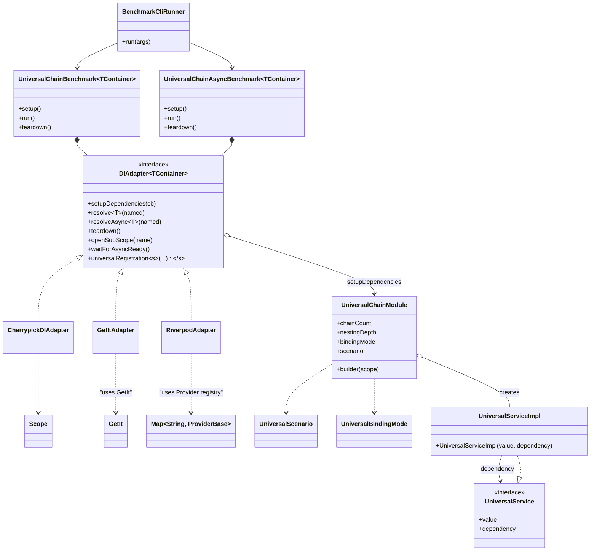

# benchmark_di

_Бенчмаркинговый набор для cherrypick, get_it и других DI-контейнеров._

## Общее описание

benchmark_di — это современный фреймворк для измерения производительности DI-контейнеров (как cherrypick, так и get_it) на синтетических, сложных и реальных сценариях: цепочки зависимостей, factory, async, именованные биндинги, override и пр.

**Возможности:**
- Универсальный слой регистрации сценариев (работает с любым DI)
- Готовая поддержка [cherrypick](https://github.com/) и [get_it](https://pub.dev/packages/get_it)
- Удобный CLI для запусков по матрице значений параметров и различных форматов вывода (Markdown, CSV, JSON, pretty)
- Сбор и вывод метрик: время, память (RSS, peak), статистика (среднее, медиана, stddev, min/max)
- Легко расширять — создавайте свой DIAdapter и новые сценарии

---

## Сценарии бенчмарков

- **registerSingleton**: Регистрация и резолвинг singleton
- **chainSingleton**: Разрешение длинных singleton-цепочек (A→B→C…)
- **chainFactory**: То же, но с factory (каждый раз — новый объект)
- **asyncChain**: Асинхронная цепочка (async factory/provider)
- **named**: Разрешение по имени (например, из нескольких реализаций)
- **override**: Переопределение зависимостей в subScope

---

## Поддерживаемые DI-контейнеры

- **cherrypick** (по умолчанию)
- **get_it**
- Легко добавить свой DI через DIAdapter

Меняется одной CLI-опцией: `--di`

---

## Как запустить

1. **Установить зависимости:**
   ```shell
   dart pub get
   ```

2. **Запустить все бенчмарки (по умолчанию: все сценарии, 2 прогрева, 2 замера):**
   ```shell
   dart run bin/main.dart --benchmark=all --format=markdown
   ```

3. **Для get_it:**
   ```shell
   dart run bin/main.dart --di=getit --benchmark=all --format=markdown
   ```

4. **Показать все опции CLI:**
   ```shell
   dart run bin/main.dart --help
   ```

### Параметры CLI

- `--di` — Какой DI использовать: `cherrypick` (по умолчанию) или `getit`
- `--benchmark, -b` — Сценарий: `registerSingleton`, `chainSingleton`, `chainFactory`, `asyncChain`, `named`, `override`, `all`
- `--chainCount, -c` — Сколько параллельных цепочек (например, `10,100`)
- `--nestingDepth, -d` — Глубина цепочки (например, `5,10`)
- `--repeat, -r` — Повторов замера (по умолчанию 2)
- `--warmup, -w` — Прогревочных запусков (по умолчанию 1)
- `--format, -f` — Формат отчёта: `pretty`, `csv`, `json`, `markdown`
- `--help, -h` — Справка

### Примеры запуска

- **Все бенчмарки для cherrypick:**
  ```shell
  dart run bin/main.dart --di=cherrypick --benchmark=all --format=markdown
  ```

- **Для get_it (все сценарии):**
  ```shell
  dart run bin/main.dart --di=getit --benchmark=all --format=markdown
  ```

- **Запуск по матрице параметров:**
  ```shell
  dart run bin/main.dart --benchmark=chainSingleton --chainCount=10,100 --nestingDepth=5,10 --repeat=3 --format=csv
  ```

---

## Универсальная регистрация зависимостей: теперь через adapter

В версии X.Y.Z вся логика сценариев регистрации DI-инфраструктуры локализована в adapter через метод `universalRegistration`.

### Использование в Dart:

```dart
final di = CherrypickDIAdapter(); // или GetItAdapter(), RiverpodAdapter() и т.д.

di.setupDependencies(
  di.universalRegistration(
    scenario: UniversalScenario.chain,
    chainCount: 10,
    nestingDepth: 5,
    bindingMode: UniversalBindingMode.singletonStrategy,
  ),
);
```
- **Теперь нет необходимости вызывать глобальные функции или switch-case по типу DI!** Каждый adapter сам предоставляет типобезопасную функцию регистрации.

### Как добавить новый сценарий или DI:

- Реализуйте метод `universalRegistration<S extends Enum>(...)` в своём adapter.
- Можно использовать как UniversalScenario, так и собственные enum-сценарии!
- Бенчмарки CLI автоматически расширяются под ваш DI и ваши сценарии, если реализован метод-расширение.

### Запуск CLI (все сценарии DI Cherrypick, GetIt, Riverpod):

```
dart run bin/main.dart --di=cherrypick --benchmark=all
dart run bin/main.dart --di=getit --benchmark=all
dart run bin/main.dart --di=riverpod --benchmark=all
```

Смотрите примеры готовых adapters в `benchmark_di/lib/di_adapters/`.

## Преимущества

- **Type-safe:** Исключено использование dynamic/object в стороне DI.
- **Масштабируемость:** Новый сценарий — просто enum + метод в adapter.
- **Вся логика регистрации теперь только в adapter:** Добавление или изменение не затрагивает глобальные функции.


---

## Архитектура



---

## Метрики

Всегда собираются:
- **Время** (мкс): среднее, медиана, stddev, min, max
- **Память**: прирост RSS, пиковое значение RSS

## Лицензия

MIT
